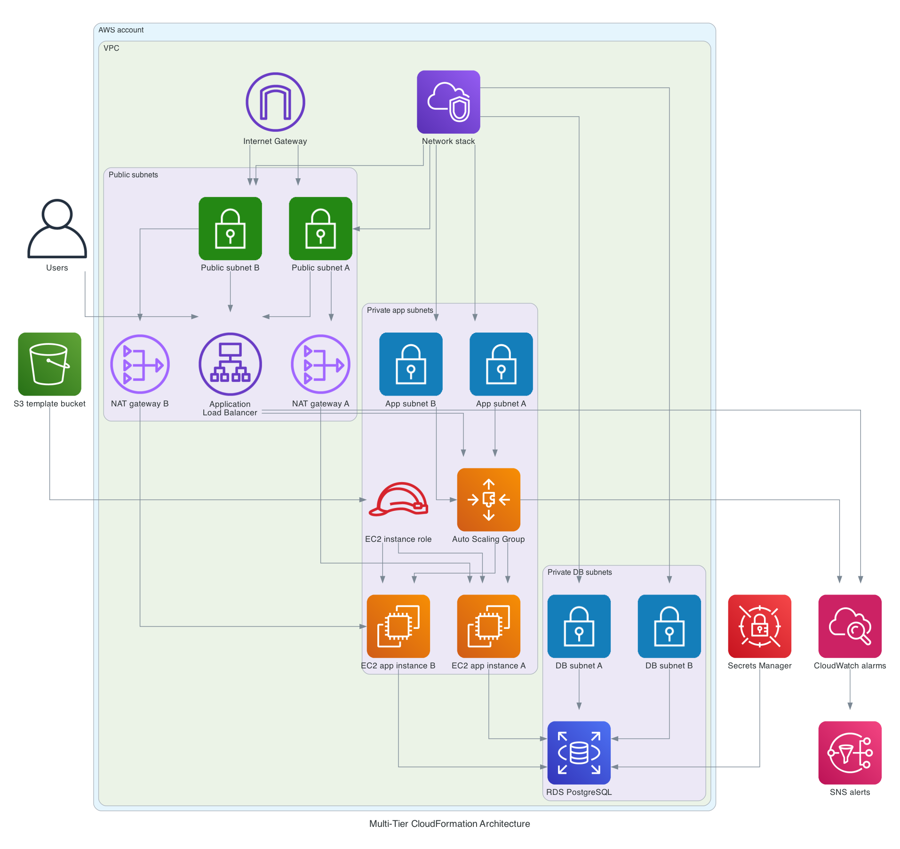

# MultiTierCloudFormation

This project deploys a simple multi-tier application on AWS by using modular CloudFormation templates.

It creates the network, security, load balancer, compute, database, secrets, and monitoring layers as separate nested stacks. The goal is to keep the setup easy to follow, easy to update, and close to real-world infrastructure.

## What This Project Builds

- A VPC with public and private subnets across two Availability Zones
- An Internet Gateway and NAT Gateways
- Security groups for the load balancer, application servers, and database
- An Application Load Balancer
- EC2 instances in an Auto Scaling Group
- An RDS PostgreSQL database in private subnets
- A Secrets Manager secret for database credentials
- CloudWatch alarms and SNS alerts

## Architecture



The architecture image is generated from [`../Diagrams/multitier_cloudformation_architecture.py`](/Users/kwakurich/Documents/Tutorials/Diagrams/multitier_cloudformation_architecture.py) so the diagram can be updated from code instead of maintaining Mermaid by hand.

## Stack Layout

The root stack is [`main.yaml`](/Users/kwakurich/Documents/Tutorials/MultiTierCloudFormation/main.yaml). It deploys the following nested stacks in order:

1. `network`
2. `security`
3. `alb`
4. `compute`
5. `secrets`
6. `database`
7. `monitoring`

This split makes the project easier to read and easier to troubleshoot when one layer fails.

## Repository Structure

```text
MultiTierCloudFormation/
├── README.md
├── main.yaml
├── assets/
│   └── multitier-cloudformation-architecture.png
├── parameters/
│   ├── dev.json
│   └── prod.json
├── scripts/
│   ├── deploy.sh
│   └── validate.sh
├── app/
│   └── userdata.sh
└── template-structure/
    ├── network/
    ├── security/
    ├── alb/
    ├── compute/
    ├── secrets/
    ├── database/
    └── monitoring/
```

## How It Works

This project is split into layers. Each layer has a clear job, and the parent stack connects them together.

### Network Layer

The network layer is the base of the whole setup. It creates the VPC and splits it into public and private subnets across two Availability Zones.

The public subnets are used for internet-facing resources. In this project, that means the Application Load Balancer and the NAT Gateways live there.

The private application subnets are used for EC2 instances. These servers do not get public IP addresses, which means users on the internet cannot connect to them directly.

The private database subnets are reserved for the database layer. Keeping the database in private subnets reduces exposure and keeps the data tier separated from the web entry point.

The network layer also creates:

- an Internet Gateway for public internet access
- route tables for public and private traffic
- NAT Gateways so private instances can reach the internet for updates and package installs without becoming public

In simple terms, this layer decides where traffic can enter, where servers can live, and how outbound traffic is handled.

### Security Layer

The security layer controls who can talk to what.

It creates three security groups:

- the ALB security group, which accepts traffic from the internet on ports `80` and `443`
- the application security group, which only accepts traffic from the ALB
- the database security group, which only accepts traffic from the application layer

This is important because it keeps the traffic path narrow:

1. users reach the load balancer
2. the load balancer reaches the application servers
3. the application servers reach the database

That means:

- users cannot connect straight to EC2
- users cannot connect straight to RDS
- the database is only reachable from the app tier

This layer also creates the IAM role and instance profile for EC2. That gives the instances permission to use Systems Manager and read the user data bootstrap script from S3.

### Load Balancer Layer

The load balancer layer creates the public entry point for the application.

The Application Load Balancer sits in the public subnets and sends requests to the EC2 instances registered in the target group. This gives you a single DNS name for the app instead of exposing individual instances.

The target group performs health checks on the application path `/`. If an instance stops responding correctly, the load balancer can stop sending traffic to it.

HTTP is enabled by default. HTTPS is optional and only becomes active when both of these are true:

- `EnableHTTPS` is set to `"true"`
- `SSLCertificateArn` contains a valid ACM certificate ARN

This makes the setup easier to deploy at first while still leaving room for a cleaner production setup later.

### Compute Layer

The compute layer creates the EC2 launch template and the Auto Scaling Group.

The launch template defines how each EC2 instance should be created. It includes:

- the Amazon Linux AMI
- the instance type
- the instance profile
- the application security group
- IMDSv2 settings
- bootstrap commands through user data

The Auto Scaling Group launches two instances across the private application subnets. This improves availability because the app is not tied to a single server or a single Availability Zone.

When an instance starts, it runs the bootstrap process. The instance downloads the user data script from S3 and installs Nginx. For this project, Nginx serves a simple test page so you can verify that the compute layer and load balancer are working together.

This layer is where the application tier becomes real. The earlier layers prepare the path, and the compute layer places the servers into that path.

### Secrets Layer

The secrets layer creates a secret in AWS Secrets Manager for the database credentials.

Instead of hardcoding the database password in the database template, this project stores the credentials in a managed secret. That is a better pattern than placing raw passwords directly in the infrastructure code or parameter files.

The secret currently stores values for:

- database name
- database username
- generated password

This keeps sensitive data in a service designed for secret storage and rotation.

### Database Layer

The database layer creates the PostgreSQL RDS instance and the DB subnet group.

The DB subnet group places the database in the private database subnets. The database is not public, and it uses the database security group created earlier.

The template reads the database values from Secrets Manager. That means the infrastructure still knows how to build the database, but the secret values are managed outside the template body itself.

This layer is separate from compute on purpose. In real projects, the application layer often changes more often than the database layer. Splitting them makes updates easier to reason about.

### Monitoring Layer

The monitoring layer gives basic visibility into the health of the environment.

It creates:

- an SNS topic for notifications
- a CloudWatch alarm for unhealthy targets behind the ALB
- a CloudWatch alarm for high CPU usage in the Auto Scaling Group

The ALB alarm helps you spot when the app tier stops serving traffic correctly.

The CPU alarm helps you notice when the application instances are under pressure.

This is a simple monitoring setup, but it introduces an important idea: infrastructure is not complete until you can also observe its health.

## Request Flow

The request path through the system looks like this:

1. a user sends a request to the load balancer
2. the ALB checks for a healthy EC2 target
3. the ALB forwards the request to one of the app instances
4. the app instance serves the response
5. if the application needs data, it connects to the PostgreSQL database through the private network

At no point does the user connect directly to the EC2 instances or the database.

## Why the Layers Are Split

This project uses nested stacks because they make the setup easier to manage.

Benefits of this approach:

- each layer has one main responsibility
- problems are easier to isolate during deployment
- templates are easier to read than one large file
- updates can be made with less confusion
- the design is closer to how teams structure infrastructure in larger projects

For example, if the compute layer fails, you can inspect the compute template without mixing that issue with networking or database logic.

## Prerequisites

Before deploying, make sure you have:

- an AWS account
- AWS CLI installed and configured
- permission to create VPC, EC2, IAM, ALB, RDS, SNS, CloudWatch, and Secrets Manager resources
- an S3 bucket to store nested templates and the EC2 user data script

## Create the S3 Bucket

This project expects a bucket for nested templates and bootstrap files.

Example:

```bash
aws s3 mb s3://codegenitor-cfn-templates --region us-east-1
```

Block public access:

```bash
aws s3api put-public-access-block \
  --bucket codegenitor-cfn-templates \
  --public-access-block-configuration BlockPublicAcls=true,IgnorePublicAcls=true,BlockPublicPolicy=true,RestrictPublicBuckets=true
```

Enable versioning:

```bash
aws s3api put-bucket-versioning \
  --bucket codegenitor-cfn-templates \
  --versioning-configuration Status=Enabled
```

## Parameters

Environment values are stored in:

- [`parameters/dev.json`](/Users/kwakurich/Documents/Tutorials/MultiTierCloudFormation/parameters/dev.json)
- [`parameters/prod.json`](/Users/kwakurich/Documents/Tutorials/MultiTierCloudFormation/parameters/prod.json)

This keeps deployment values in one place instead of writing long parameter lists by hand.

## Validate the Templates

From the project root:

```bash
./scripts/validate.sh
```

## Deploy

Deploy `dev`:

```bash
./scripts/deploy.sh dev
```

Deploy `prod`:

```bash
./scripts/deploy.sh prod
```

The deploy script:

- validates the templates
- uploads nested templates to S3
- uploads the EC2 user data script to S3
- creates the stack if it does not exist
- updates the stack if it already exists

## Useful Commands

Check stack status:

```bash
aws cloudformation describe-stacks \
  --stack-name multi-tier-dev \
  --query "Stacks[0].StackStatus" \
  --output text
```

Check stack events:

```bash
aws cloudformation describe-stack-events \
  --stack-name multi-tier-dev \
  --query "StackEvents[*].[Timestamp,LogicalResourceId,ResourceType,ResourceStatus,ResourceStatusReason]" \
  --output table
```

Get the load balancer DNS name:

```bash
aws cloudformation describe-stacks \
  --stack-name multi-tier-dev \
  --query "Stacks[0].Outputs[?OutputKey=='LoadBalancerDnsName'].OutputValue" \
  --output text
```

Delete the stack:

```bash
aws cloudformation delete-stack --stack-name multi-tier-dev
aws cloudformation wait stack-delete-complete --stack-name multi-tier-dev
```

## Notes

- The EC2 instances are placed in private subnets and use NAT for outbound access.
- The application is currently a simple Nginx page installed by [`app/userdata.sh`](/Users/kwakurich/Documents/Tutorials/MultiTierCloudFormation/app/userdata.sh).
- HTTPS support is optional by design.
- This project creates billable AWS resources, including NAT Gateways, EC2, ALB, RDS, and Secrets Manager.

## Why This Repo Is Useful

This repo is useful if you want to learn how to:

- split a large CloudFormation setup into nested stacks
- build a basic multi-tier AWS environment
- separate public and private workloads
- wire EC2, ALB, RDS, Secrets Manager, and monitoring together
- deploy infrastructure in a repeatable way with simple scripts

## Future Improvements

Possible next steps for this project:

- add WAF in front of the ALB
- add S3 bucket policies and encryption checks
- add rollback and drift checks to the deploy flow
- add application health checks beyond a static Nginx page
- add CI validation for pull requests
